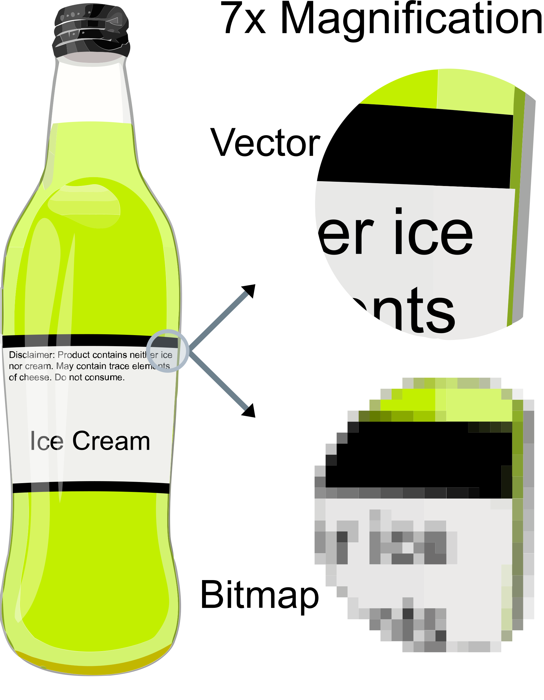

```{r echo=FALSE,warning=FALSE}
# this is so that figures are displayed in their proper place in the text, and not all at the end. 
library(knitr)
  opts_chunk$set(fig.path='figure/graphics-', cache.path='cache/graphics-', fig.align='center',
                 external=TRUE, echo=TRUE, warning=FALSE, fig.pos='H')
```

```{r setup, include=FALSE}
knitr::opts_chunk$set(echo = TRUE)
```

```{r, include=F}
setwd("~/Documents/GitHub/CommunicatingFigures/01_Color_Form")
```

# Visual File Types

Designing valuable high quality figures or illustrations takes time and energy. We can best take advantage of this investment by creating products that we can easily adjust, build upon, or reuse. 

In order to do this, we need to consider how they're composed, so that we understand what we're working with.  
Image files are almost always stored in one of two basic formats, (**1**) raster or (**2**) vector.

Raster displays (also called bitmap) like a computer screen, are composed of a rectangular grid of pixels. We fill each pixel with color, mosaic them together, and put together an image.

* Common file types: 
  + PNG
  + JPEG
  + GIF

Vector displays are stored as lines and fills denoted by 2D points, and so an image is not subdividied into individual cells like in rasters. This allows vector images to scale better (both up *and* down in size).

* Common file types: 
  + SVG
  + PDF
  + EPS
  + AI
  
```{r Rasta, echo=FALSE, out.height = '100%', fig.pos='H', eval=T, fig.cap="To make sure that you never forget the difference between the two basic image types, I've made you a *Rasta Raster* of Bob Marley, where each 'pixel' is an image of a dog. Ta-da. Really I guess this is actually some sort of meta-raster Rasta."}
knitr::include_graphics("IMGs/Rasta_Raster_small.png")
```
  
\  

## Making the Case for Vectorized Graphics

Because vector graphics aren't stored as pixels, they're more flexible to changes in size, without changing image quality. For example, if you wanted to use the same design to print a birthday card and a billboard using a raster file, you'd likely have to create low-res and hi-res versions of the same image. The size of the file scales with the quality, so your birthday card image may only be a few kilobytes, but your billboard image might be hundreds of megabytes. In contrast, a vectorized version would have the same file size and quality regardless.

Let's see this in action:

```{r Vector, echo=FALSE, out.width = '75%', fig.pos='H', eval=T, fig.cap="A simple visual explanation of vector vs. raster formats. Ironically, this image is saved as a PNG (a raster format). More information is available at https://en.wikipedia.org/wiki/Vector_graphics"}

```

In addition to the convenience of size scaling, keeping our illustrations, figures, or whatever in a vector file format will assure us that we can go back and edit aspects of the original *ad infinitum*. 

We will all now pinky-swear to export our plots/figures/*et al.* in vector format, preferrably as PDFs. 

---

# Package Prep

Start by loading a few common packages for visualization in R. If you don't have these packages already installed, we can do that first.
```{r, eval=F}
install.packages("ggplot2")
install.packages("phytools")
install.packages("gridExtra")
install.packages("RColorBrewer")
install.packages("viridis")
install.packages("dplyr")
```

\  

Load 'em if you got 'em
```{r, warning=F, message=F}
library(ggplot2)
library(phytools)
library(gridExtra)
library(RColorBrewer)
library(viridis)
library(dplyr)
```

\  

---

# Color Palettes

There are a million and one color palettes available in R now. It seems like a new one pops up everyday.  
Let's have a look at some color schemes
```{r}
display.brewer.all()
``` 

Roughly 4.5% of the world's population (345 million people!) are colorblind to some extent. So maybe let's consider colorblind friendly palettes:
```{r}
display.brewer.all(colorblindFriendly = T)
``` 

For reference, the package *scales* has a useful function *show_col()* for looking at palettes.  
This gives us the hex numbers (#......) which we can use to choose specific colors. Hex numbers can also come in handy if you want to identify a specific color later in Adobe Illustrator.
```{r, message=F}
library(scales)
library(wesanderson)
library(colRoz)
show_col(wes_palette("Zissou1", 6, type="continuous"))
show_col(brewer.pal(6, "Paired"))
show_col(colRoz_pal("c.kingii", 6))
show_col(viridis(6))
```

---

# Using Color and Shape in Figures

Enough of that, let's load and plot some data to quickly mention color and shape.
```{r}
goannas <- readRDS("Goannas.RDS")
names(goannas); 
sizes <- goannas$size.data
sizes <- mutate(sizes, 
                TailRatio = Tail/Body_Length)
head(sizes)
```

Do a preliminary plot of the data so we can see what we want to change.
```{r}
ggplot(sizes, aes(x=log(Body_Length), y=TailRatio)) +
  geom_point()
```

I don't want to get too caught up here, but there are a few quick things we want to keep in mind.

* the grey background is cluttered
* the points are too small to see
* the data really aren't telling us much here

We can try again, by adjusting just a few simple commands
```{r, message=F}
ggplot(sizes, aes(x=log(Body_Length), y=TailRatio)) +
  geom_point(size=5, alpha=0.75, aes(color=Habitat)) + theme_bw()
```
This is still horrifying to the eyes.  
Let's think about how color and shape can improve the plot.

<!--
```{r}

YGB <- colorRampPalette(brewer.pal(5, "YlGnBu"))
YGBcolors <- YGB(nrow(sizes)); 
SPC <- colorRampPalette(brewer.pal(5, "Spectral"))
SPCcolors <- SPC(nrow(sizes))
RED <- colorRampPalette(brewer.pal(5, "Reds"))
REDcolors <- RED(nrow(sizes))
BLU <- colorRampPalette(brewer.pal(5, "Blues"))
BLUcolors <- BLU(nrow(sizes))
#goannas$Name_in_Tree <- factor(goannas$Name_in_Tree, levels = goannas$Name_in_Tree[order(goannas$SVL)])
sizes <- sizes[order(sizes$TailRatio),]
sizes <- mutate(sizes, plotcolsYGB = YGBcolors) # could've also just done 'goannas$plotcols <- gcolors'
sizes <- mutate(sizes, plotcolsSPC = SPCcolors)
sizes <- mutate(sizes, plotcolsRED = REDcolors)
sizes <- mutate(sizes, plotcolsBLU = BLUcolors)
```

```{r}
YGBplot <- ggplot(sizes, aes(x=log(Body_Length), y=TailRatio)) +
  geom_point(color=sizes$plotcolsYGB, size=5) + theme_classic()
```

```{r}
SPCplot <- ggplot(sizes, aes(x=log(Body_Length), y=TailRatio)) +
  geom_point(color=sizes$plotcolsSPC, size=5) + theme_classic()
```

```{r}
REDplot <- ggplot(sizes, aes(x=log(Body_Length), y=TailRatio)) +
  geom_point(color=sizes$plotcolsRED, size=5) + theme_classic()
```

```{r}
BLUplot <- ggplot(sizes, aes(x=log(Body_Length), y=TailRatio)) +
  geom_point(color=sizes$plotcolsBLU, size=5) + theme_classic()
```
--> 

```{r}
YGBplot <- ggplot(sizes, aes(x=log(Body_Length), y=TailRatio)) +
  geom_point(size = 5, aes(colour = Habitat)) + 
  scale_color_brewer(palette = "YlGnBu") +
    theme_classic()
```

```{r}
SPCplot <- ggplot(sizes, aes(x=log(Body_Length), y=TailRatio)) +
  geom_point(size = 5, aes(colour = Habitat)) + 
  scale_color_brewer(palette = "Spectral") +
    theme_classic()
```

```{r}
REDplot <- ggplot(sizes, aes(x=log(Body_Length), y=TailRatio)) +
  geom_point(size = 5, aes(colour = Habitat, shape = Habitat)) + 
  scale_shape_manual(values = c(15:18)) +
  scale_color_brewer(palette = "RdYlBu") +
    theme_classic()
```

```{r}
BLUplot <- ggplot(sizes, aes(x=log(Body_Length), y=TailRatio)) +
  geom_point(size = 5, aes(colour = Habitat, shape = Habitat)) +
  scale_shape_manual(values = c(15:18)) +
  scale_color_brewer(palette = "Blues") +
    theme_classic()
```

```{r, message=F}
together <- grid.arrange(SPCplot, YGBplot, BLUplot, REDplot, nrow=2)
```
Save this for later, and we can come back to edit it.
```{r, message=F}
ggsave(filename = "Color_Comparison.pdf",
       plot = together,
       useDingbats = F)
```

---


