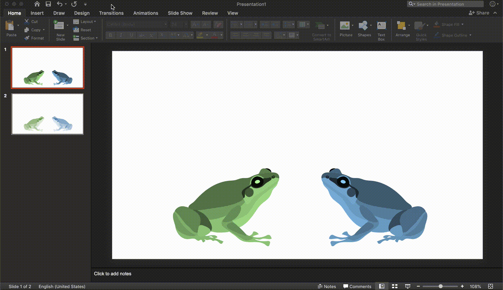
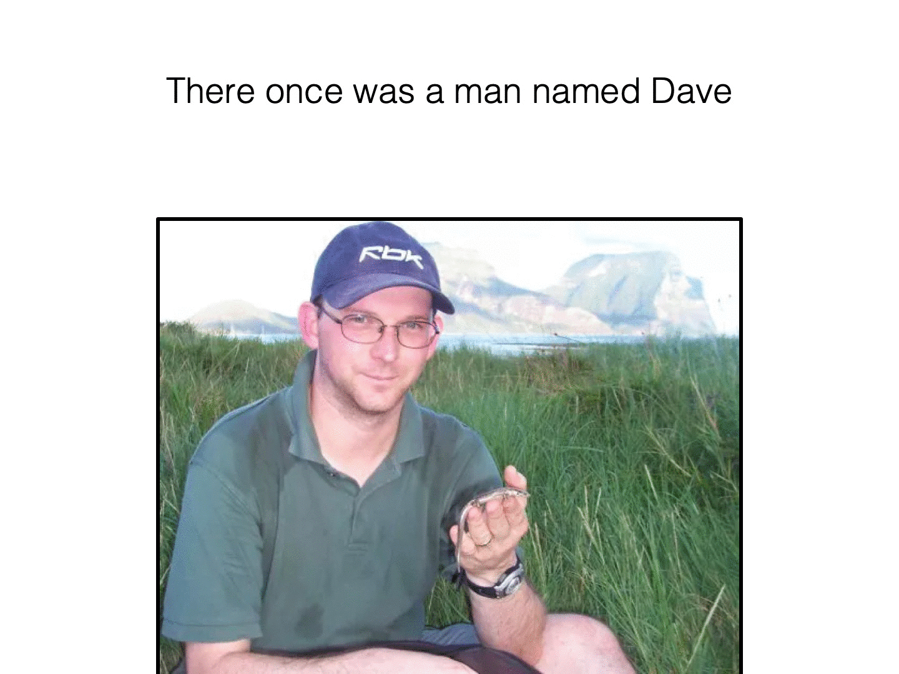

```{r setup, include=FALSE}
knitr::opts_chunk$set(echo = TRUE)
```

Making a GIF from a set of images is super easy. There are 1,001 ways to do this online with free gif converters, but they all stick their awful watermark on your beautiful creation. Instead, we'll do it ourselves, and have a little more control over the output. 

Start by opening the PowerPoint presentation in this folder (*Example_PowerPoint.pptx*). We'll export each slide as a jpeg (though you could choose other file types) by going:
File --> Export --> File Format --> JPEG --> Export

```{r PPT, echo=FALSE, out.height = '100%', fig.pos='H', eval=T, fig.cap=""}

```

Great. We now have each slide as a separate image. Now we can go back to R. 

Install packages if you haven't already
```{r, eval=F}
install.packages("purrr")
install.packages("magick")
```

Load them when you got 'em
```{r, message=F}
library(purrr); 
library(magick);
```

Set your working directory if you'd like
```{r, eval=F}
setwd("~/Documents/GitHub/CommunicatingFigures/03_Build_GIF/Dave_Limerick")
```

Give our GIF file a name
```{r}
gifname <- "Dave_Limerick"
```

List those images  
Read them in  
Make the animation!
```{r}
list.files(path = paste0(getwd(),"/Dave_Limerick/"), pattern = "*.jpeg", full.names = T) %>% 
  map(image_read) %>% # reads each path file
  image_join() %>% # joins image
  image_animate(fps=0.4) %>% # animates, can set the Frames Per Second or number of loops
  image_write(paste0(getwd(),"/", gifname,".gif")) # write to current dir
```

*magick* will stick the images together into a GIF. We may want to adjust aspects of the rate (FPS---frames per second), how many times it loops (1--indefinitely), or the image size, and all of those are options we can play around with to get the optimum GIF. 

---

Finally, we should appreciate our hard work, look at our Dave-GIF!

```{r Dave, echo=FALSE, out.height = '50%', fig.pos='H', eval=T, fig.cap=""}

```


