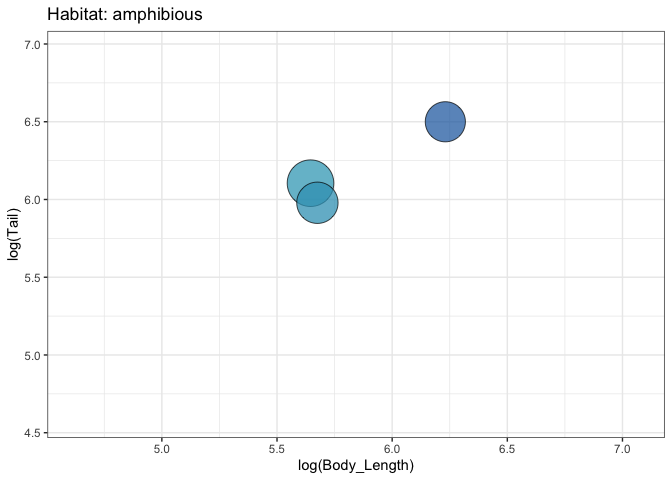
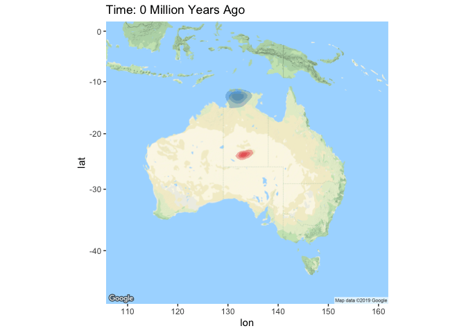

```{r setup, include=FALSE}
knitr::opts_chunk$set(echo = TRUE)
```

The previous method (*03_Build_GIF*) to create a GIF in R from a series of images is surely the shortcut way, and we can do better.  
The *gganimate* package can make this process much smoother, especially if we already have some understanding of the syntax in *ggplot2*. 

Install then load the below packages.
```{r, message=F}
library(transformr)
library(gganimate)
library(ggplot2)
library(RColorBrewer)
library(dplyr)
library(phytools)
library(ggmap)
```

```{r, include=F, eval=F}
setwd("~/Documents/GitHub/CommunicatingFigures")
```

Let's read in the same data we've been playing with already. 
```{r}
goannas <- readRDS("Data/Goannas.RDS")
traits <- mutate(goannas$size.data,
                 TailRatio = Tail/Body_Length)
```

Before we get into plotting, we want to define a color scheme that we're happy working with. 
```{r}
gramp <- colorRampPalette(brewer.pal(5, "YlGnBu"))
gcolors <- gramp(nrow(traits)); 
traits <- traits[order(traits$Body_Length),]
traits <- mutate(traits, plotcols = gcolors)
```

Now let's plot the data, and animate it. Once we've got this GIF, I'll try to explain how it's all working. 
```{r}
TailSVL <- ggplot(traits, 
                  aes(x=log(Body_Length), 
                      y=log(Tail),
                      size=TailRatio)) +
  geom_point(alpha=0.75, 
             show.legend=FALSE, 
             color="black", 
             fill=traits$plotcols, 
             shape=21) + 
  # designate color here to keep the smoothness
  theme_bw() +
  scale_size(range=c(5,20)) +
  labs(title="Habitat: {closest_state}") + 
  # this will label the plot by the groupings
  transition_states(Habitat, 
                    transition_length=5, 
                    state_length=3) +
  ease_aes('cubic-in-out')
```

Save the GIF externally
```{r, eval=T}
anim_save(TailSVL, file="TailSVL.gif")
```



The beauty of *gganimate* is that we set up the plot just like we would our normal static *ggplot* figure.
```{r}
ggplot(traits,
       aes(x=log(Body_Length),
           y=log(Tail),
           size=TailRatio)) +
  geom_point(alpha=0.75, 
             show.legend=FALSE, 
             color="black", 
             fill=traits$plotcols, 
             shape=21) + 
  # designate color here to keep the smoothness
  theme_bw() +
  scale_size(range=c(5,20))
```

We've plotted **Tail** length as a function of **Body_Length**, with each point colored scaled to the **Tail/Body_Length** ratio. Great. 

All we need to animate this now is to split our plot up into a factor. This could be discrete bins of some value, or in our case, we'll split the plots up by the preferred habitat type **Habitat**. We also choose how much time for the GIF to stay in each frame (*state_length*), and how long it should take to transition between frames (*transition_length*). 
```{r, eval=F}
  transition_states(Habitat, 
                    transition_length=5, 
                    state_length=3) +
  ease_aes('cubic-in-out')
```

Sick one. Maybe we have time/data to create another!

How about animating the evolution of species ranges?
```{r}
ranges <- filter(goannas$distribution.data, 
                 Name_in_Tree == "Varanus.mertensi" |
                 Name_in_Tree == "Varanus.giganteus")
ranges$Time <- 0
```

Grab the distribution for MRCA of these taxa (node 56)
```{r}
mrcaVg <- filter(goannas$rase.data$DistData, 
                 Name_in_Tree == "n56")[,1:3]
mrcaVg$Name_in_Tree <- "Varanus.giganteus"

mrcaVm <- filter(goannas$rase.data$DistData,
                 Name_in_Tree == "n56")[,1:3]
mrcaVm$Name_in_Tree <- "Varanus.mertensi"

mrca <- rbind(mrcaVg, mrcaVm)
# set the time of the MRCA
mrca$Time <- round(max(nodeHeights(goannas$phy)) -
  nodeheight(goannas$phy, 56), 2)
# combine with the current distribution
ranges <- rbind(mrca, ranges)
```

Now we plot the ranges and animate the transitions  
To recreate this, you'll have to set up a google API in order to use *ggmap* and the function *get_googlemap*
```{r}
rangemap <- get_googlemap(center = "Australia", zoom = 4, style = 'feature:all|element:labels|visibility:off')

MRCA_range <- ggmap(rangemap) +
  stat_density2d(aes(x = Longitude, 
                     y = Latitude, 
                     fill = Name_in_Tree), 
                 alpha = 0.3, bins = 4,
                 geom = "polygon", data = ranges) + 
  theme(legend.position = 'none') +
  scale_fill_manual(values = c("#E31A1C", "#1F78B4")) +
  labs(title="Time: {closest_state} Million Years Ago") +
  transition_states(Time, 
                    transition_length=5, 
                    state_length=3) +
  ease_aes('cubic-in-out')
```

Save the GIF externally
```{r, eval=T}
anim_save(MRCA_range, file="N56_MRCA_range.gif")
```


