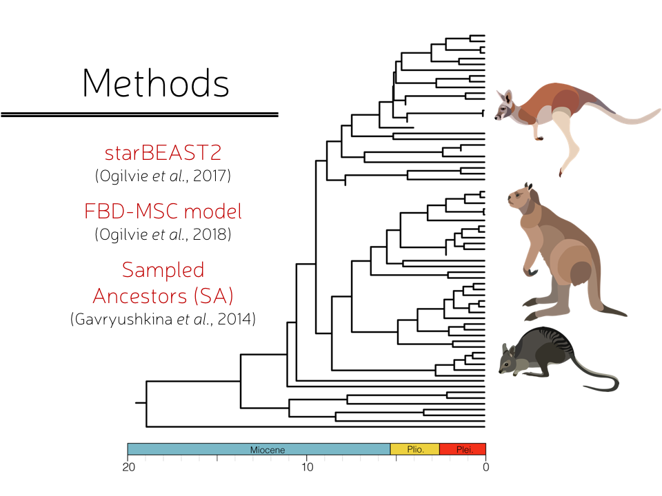

```{r echo=FALSE,warning=FALSE}
# this is so that figures are displayed in their proper place in the text, and not all at the end. 
library(knitr)
  opts_chunk$set(fig.path='figure/graphics-', cache.path='cache/graphics-', fig.align='center',
                 external=TRUE, echo=TRUE, warning=FALSE, fig.pos='H')
```

```{r setup, include=FALSE}
knitr::opts_chunk$set(echo = TRUE)
```

```{r, include=F, eval=F}
setwd("~/Documents/GitHub/CommunicatingFigures/06_Figure_Design")
```


# The Rule of Thirds

One of the most basic rules for good visual composition is the **Rule of Thirds**. We divide an image or canvas into thirds both vertically and horizontally, and notice where these planes cross one another. These tend to be areas of natural focus because they provide enough room and context between where they are and the border, and direct our eyes towards other points of interest.

```{r S1, echo=FALSE, out.height = '100%', fig.pos='H', eval=T, fig.cap="Points of interest generally fall at the intersection of the thirds (crosses), or along the planes (lines)."}

```

If we use an example photograph below, we see how the figure falls along one of these planes, and the valley/crevasse falls along another perpendicular axis. The figure faces in towards the feature, directing our eyes in this direction, and stimulates us to search the rest of the image.

```{r S2, echo=FALSE, out.height = '100%', fig.pos='H', eval=T, fig.cap="An example of the rule of thirds in photography."}

```

Some of this probably sounds a bit heady and art-school-y, but it has to do with general design principles and how we look at images. In figures for publication we are often constrained by space, meaning we have to be efficient about translating lots of information in a small area. In presentations, we have much looser rules, and can play with this design much more. Let's look at another image.

---

```{r S3, echo=FALSE, out.height = '100%', fig.pos='H', eval=T, fig.cap=""}
knitr::include_graphics("IMGs/Slide3.png")
```

Here's an example slide that's alright by most standards. However, there are a few simple things we can do to have it conform to better balance and direction.

```{r S4, echo=FALSE, out.height = '100%', fig.pos='H', eval=T, fig.cap=""}

```
By turning the illustrations to face inwards, we direct the viewer's attention towards the tree. Moving the methods slightly nearer to the first vertical third, we provide a buffer on the left side of the slide. 

```{r S5, echo=FALSE, out.height = '100%', fig.pos='H', eval=T, fig.cap=""}

```

# Core principles

About now you might be thinking "yeah, but those are things I already would've done." And if you are, that's great! This affirms that most people have a natural inclination towards good composition. If not, then there are some basic design principles to consider when creating a figure:

+ **SHAPE**: the two dimensional form of an object. How can I use shape to help convey an idea or distinguish parts of an idea?

+ **SPACE**: the room around and between elements in a figure. Does my image look cramped? Are different parts of the figure clearly delimited? Is there *too* much space?

+ **COLOR**: the visible light of an object. When we talk about color, we also often mention *hue* (the actual color name), *saturation* (the richness of a color, deep red, light pink, etc.), *shade* (is it more towards the light/white end of the spectrum, or the black/dark side?), and *opacity/translucency* (the opaqueness or clearness of a color). Many of these elements are intertwined, but they all are valuable. How can they convey mood and pace?

+ **BALANCE**: the distributed weight of an image. Are the elements all bunched in a corner, or spread throughout? What can these different uses convey?

+ **MOVEMENT**: how does the viewer's eye move through the figure/slide? Does it follow a logical narrative? Is it useful, or distracting?

+ **PROPORTIONS**: the relative size of objects to one another. How can we convey the importance of some objects relative to others?

Like I mentioned above, many of these aspects are intuitive, but not all of them are to everyone, and we each have our strengths and weaknesses. There are plenty of other considerations, such as **texture** and **harmony**, but I think those mentioned above form a core theme in design.