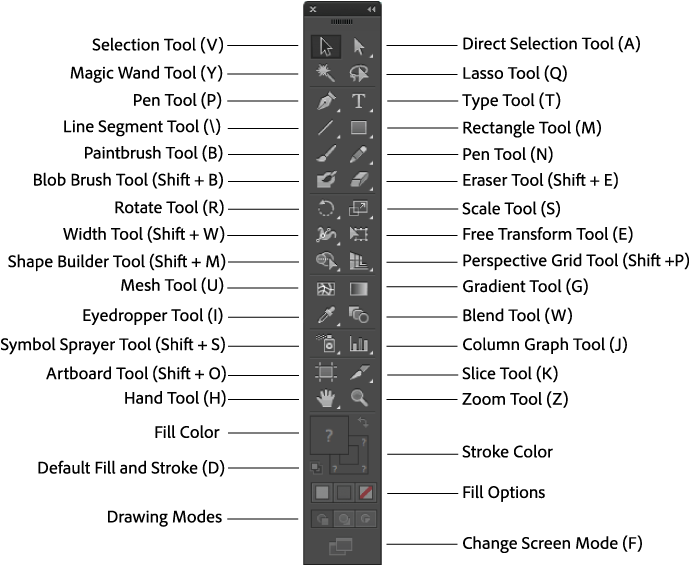
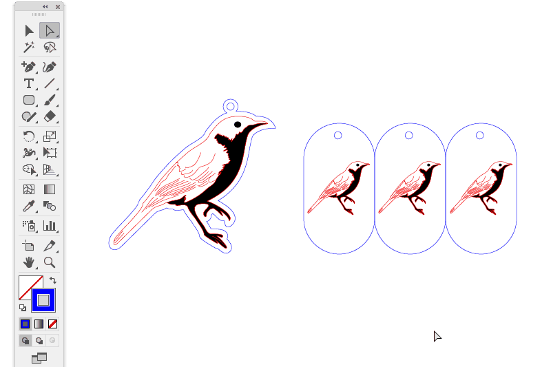
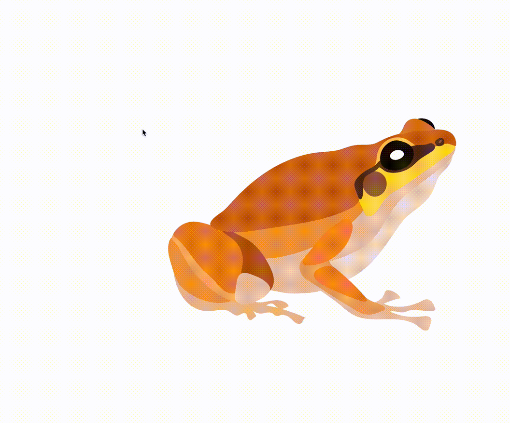
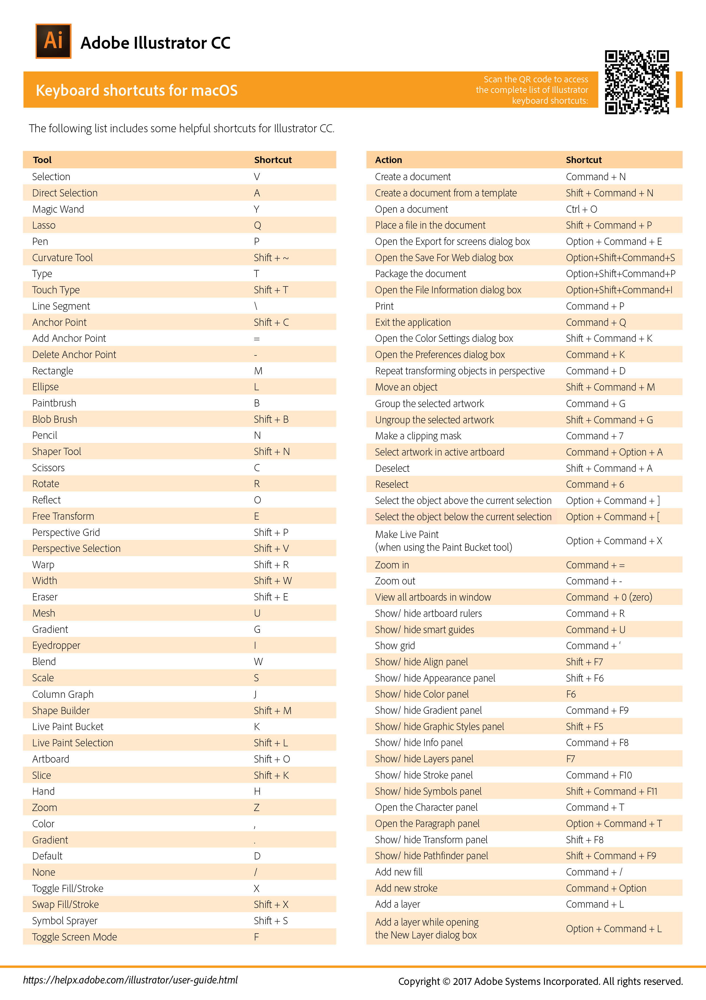

```{r setup, include=FALSE}
knitr::opts_chunk$set(echo = TRUE)
```

```{r echo=FALSE,warning=FALSE}
# this is so that figures are displayed in their proper place in the text, and not all at the end. 
library(knitr)
  opts_chunk$set(fig.path='figure/graphics-', cache.path='cache/graphics-', fig.align='center',
                 external=TRUE, echo=TRUE, warning=FALSE, fig.pos='H')
```

# Learning Adobe Illustrator

Adobe Illustrator is a remarkably felxible and powerful tool. It's massively popular with digital artists and designers, and functionally it overlaps quite a bit with some other Adobe Creative Cloud programs. 

Versatility is a double-edged sword though, and the learning curve for Ai can feel steep. Fret not! There are tons of Adobe Illustrator tutorials available online, and a seemingly infinite number of Illustrator youtube videos to turn to when you're not sure how to do something, or want to do it more efficiently.

My general feeling is that Ai is a lot like coding, in that you:

* start out thinking you'll never be able to do it well, and that everyone else is a whiz
* learn enough that you can do some stuff
* learn enough that you can search efficiently to find out how to do the stuff you don't know how to do
* realize pretty much everyone except professional illustrators and graphic designers has to look up how to do things in Ai sometimes
* find out *even* professional illustrators and graphic designers need to look up how to do things in Ai sometimes

### Tutorials 
The [best tutorial](https://www.pgsd.org/cms/lib07/PA01916597/Centricity/Domain/202/illustrator_for_beginners_tastytuts.pdf) I've come across is by [Gareth Davis Studio](https://www.youtube.com/channel/UC64eec0UYHxflyEWgyZOvLA). This long-format tutorial includes pretty much everything you need to know as you work your way through Ai, and is accompanied by short videos for each chapter. It is both intuitive and interactive, and I think it's a great resource to flip back to when you need an introduction or refresher on a tool or method.

When in doubt however, Youtube is probably the best resource to quickly find out how to complete a task in Ai. There's no shame in resorting to a quick video.

---

Instead of just releasing you into the wild with the program, the tutorial, and the internet at your disposal, let's walk through some of the basics of Ai and common tools we use.

First let's choose an image to play with. Because I'm in control of your free will, we'll mess around with a frog drawing. Start by opening **Cophixalus.pdf** in Illustrator. While we walk through the common Ai tools, we can try them out on this poor frog.
```{r Frog, echo=FALSE, out.width = '50%', fig.pos='H', eval=T, fig.cap=""}
knitr::include_graphics("IMGs/Cophixalus.png")
```

---

# Paths, Strokes, and Fills
### Paths 
The common denominator in Ai is the **path**. Because we're working in a vector format, pretty much everything is created, described, and delimited by paths, including the common currency which are **strokes** and **fills**.  Paths are the invisible spider web that lies under most of what we create in Ai. 
```{r Path, echo=FALSE, out.height = '100%', fig.pos='H', eval=T, fig.cap="This is a bare-bones path created by the pencil tool. Note in the bottom left (indicated by red arrow) that the stroke and fill indicators are both empty (red slash through them), showing this path currently has no visible properties."}

```

### Strokes
Strokes are lines that follow a path exactly. We can change characteristics of strokes, such as the color, weight, shape, texture, and opacity, and adjust the actual stroke by moving the points that make up the underlying path.
```{r Stroke, echo=FALSE, out.height = '100%', fig.pos='H', eval=T, fig.cap="This is a basic stroke created by the pencil tool. Note in the bottom left (indicated by red arrow) that the stroke indicator is set to black, but the fill indicator remains empty (red slash through it)."}

```

### Fills 
**Fills** are completing the positive space contained by paths. You'd be surprised by how hard it is to think of a synonym for "fill." Like strokes, we can change characteristics of fills by adjusting the color, texture, or opacity. Again, we can change the shape by moving the anchor points which comprise the underlying path. 
```{r Fill, echo=FALSE, out.height = '100%', fig.pos='H', eval=T, fig.cap=""}

```


# Layers
One of the most beautiful things about Adobe Illustrator is how we can use **layers** to isolate elements of a figure or illustration. Layers allow us to split a figure up into multiple pieces which we can work on without other elements being in the way. We using the little eyeball next to each layer, we can view or hide a layer or layers. 
```{r Layers, echo=FALSE, out.height = '100%', fig.pos='H', eval=T, fig.cap=""}

```

Better yet, we can keep layers visible, but lock them so we don't mess them up as we go. When it's time to edit those layers again, we can unlock them by clicking the little lock icon next to each layer.
```{r LayersLock, echo=FALSE, out.height = '100%', fig.pos='H', eval=T, fig.cap=""}

```

---

# Tool Use

Maybe the most important thing you can remember is that you can always undo/redo any process in Adobe Illustrator. Because of this, **undo** (Command+Z; Ctrl+Z) and **redo** (Command+Shift+Z; Ctrl+Shift+Z) are arguably the most valuable assets you have.

Let's walk through the basic tools and what they do. Then I'll give you a couple other shortcut favorites of mine. The simplest visual explanation of the available tools looks something like this:

```{r AiTools, echo=FALSE, out.width = '150%', fig.pos='H', eval=T, fig.cap="Tool names and keyboard shortcuts for Ai."}

```

Instead of reinventing the wheel, I'm going to borrow some gifs from [*Ponoko*](https://www.ponoko.com/blog/how-to-make/adobe-illustrator-tools/) to illustrate each tool's use, and fill in the gaps with my own.

In your open Ai window, try out the actions depicted in the GIFs, and I'll follow along as well.

---

### Artboard (Shift+O)
The artboard is the area in which you keep your work. Imagine it as a digital canvas. We can adjust the size of an artboard by clicking the tool (or Shift+O), and dragging from a corner or a side. Alternatively you can choose preset sizes of artboards so that you know how big a figure should be on a page, and you can create your own templates (such as for widescreen PowerPoint) if you'd like. 

```{r Artboard, echo=FALSE, out.height = '100%', fig.pos='H', eval=T, fig.cap=""}

```

---

### Selection (V)
The (V) selection tool is your broadest brush in selecting elements in your design. It will select and move the entire object chosen, without distorting it. If you want to move the object quite far, you can just drag and drop it wherever you'd like. If you'd prefer to just nudge it a bit, you can select the object, then move it with your arrow keys. If you like the control that moving with the arrow keys provides, you can hold shift as you press the arrow to move it a greater distance quickly.

```{r SelectV, echo=FALSE, out.height = '100%', fig.pos='H', eval=T, fig.cap=""}

```

---

### Direct Selection (A)
The (A) direct selection tool is the finer complement to the (V) selection tool. It will allow you to choose specific parts of an object, generally individual elements or points. This tool is super useful, but can take a little longer to get used to. If you're looking to copy or delete a part of an object, this is your guy. You can also click and drag to make a direct selection of everything within a rectangle. 

```{r SelectA, echo=FALSE, out.height = '100%', fig.pos='H', eval=T, fig.cap=""}

```

---

### Lasso (Selection) (Q)
If you're looking to make a direct selection, but of something that doesn't fit into a rectangle, you'll want the (Q) Lasso tool.

```{r Lasso, echo=FALSE, out.height = '100%', fig.pos='H', eval=T, fig.cap=""}

```

---

### Magic Wand (Y)
As the name implies, the (Y) magic wand tool is indeed magic. This tool will select objects that are similar or identical to the object you choose with the wand. To see what I mean, double-click on the wand, and it will give you the options **Fill Color**, **Stroke Color**, **Stroke Weight**, **Opacity**, and **Blending Mode**. By ticking one or more of these boxes, we can select all the same color or weighted fills and strokes. 

```{r Wand, echo=FALSE, out.height = '100%', fig.pos='H', eval=T, fig.cap=""}

```

---

### Pencil (N)
The (N) pencil tool is the most versatile drawing tool you've got at your disposal. With the pencil tool we can easily create both strokes and fills, and dictate both very specific (jagged) and general (smooth) paths. 

```{r Pencil, echo=FALSE, out.height = '100%', fig.pos='H', eval=T, fig.cap=""}

```

---

### Smoother (Shift+N)
The pencil tool has additional functionality in that it hides the smoothing tool (Shift+N). Click and hold the pencil tool to reveal the smooth tool, or click Shift+N, which will remove points along your path to create a smoother line.

```{r PencilSmooth, echo=FALSE, out.height = '100%', fig.pos='H', eval=T, fig.cap=""}

```

---

### Shaper
You could quickly create shapes with the ellipse, polygon, or rectangle tools, but you can get all the same functionality in one place with the shaper tool. Draw a simple shape, and Ai will interpret what you were going for. 

```{r Shaper, echo=FALSE, out.height = '100%', fig.pos='H', eval=T, fig.cap=""}

```

---

### Pen (P)
Once you've gotten hold of the pencil tool, you might try your hand with the (P) pen tool. This creates anchor points with handles that dictate the curve of the line at those points. It's not immediately intuitive the way the pencil tool is, but once you get a handle of it, you'll realize how nice it is to create smooth shapes and lines. 

```{r Pen, echo=FALSE, out.height = '100%', fig.pos='H', eval=T, fig.cap=""}

```

---

### Type (T)
At some point we'll probably want to add text, and we can do this with the (T) type tool. This tool has a ton you can fiddle around with (font, size, color, type along a shape, etc.), below is just the tip of the iceberg, but we can try out some alternative things too.

```{r Type, echo=FALSE, out.height = '100%', fig.pos='H', eval=T, fig.cap=""}
knitr::include_graphics("GIFs/Tools_Type_T.gif")
```

---

### Eyedropper (I)
We all know that feeling of finding a color we like. The (I) eyedropper tool makes life a little easier by letting us copy that beautiful hue and apply it whatever fill or stroke we'd like. Copy a color from an image you like just by touching with the eyedropper.

```{r Eye, echo=FALSE, out.height = '100%', fig.pos='H', eval=T, fig.cap=""}

```

---

### Align & Distribute
There are a number of align and distribute tools which will help you to get a number of objects in order. You can align them in the same orientation (left, right, center) and distribute them evenly in space as well. 

```{r Align, echo=FALSE, out.height = '100%', fig.pos='H', eval=T, fig.cap=""}

```


### Reflect (O) and Rotate (R)
We can quickly and easily (O) reflect or (R) rotate an object in Illustrator. Below I show how you can do it from the tool menu, or from the object menu. 

```{r Reflect, echo=FALSE, out.height = '100%', fig.pos='H', eval=T, fig.cap=""}

```

---

### Rulers and Grid/Snap-to-Grid
Instead of telling you how to adjust these, take a minute to search in Illustrator for how to add rulers to your image. If you're stumped, search on Google or Youtube for a solution. 

---

There are heaps more tools that are useful and you may want to use at some point. Those above are just the ones I think make an immediate difference when you're learning Illustrator. 

---

## Keyboard Shortcuts
Adobe Illustrator has an overwhelming amount of features. We'll just barely scrape the surface, but by introducing you to the functionality, hopefully you can pick up the ball and run. 

There are slightly more in-depth explanations of the tools in the [Adobe tool galleries](https://helpx.adobe.com/illustrator/using/tool-galleries.html.

\  

Adobe also provides more complete cheat sheets to keyboard shortcuts. I've included them here (one for each of the main operating systems), as a quick reference, but they can also be [found online](https://helpx.adobe.com/au/illustrator/using/default-keyboard-shortcuts.html). You'll see what I mean about "shortcuts", and why they might be useful once we start messing around with Ai in earnest.

```{r AiMac, echo=FALSE, out.height = '100%', fig.pos='H', eval=T, fig.cap="Keyboard shortcuts for Ai on Mac."}

```
```{r AiWind, echo=FALSE, out.height = '100%', fig.pos='H', eval=T, fig.cap="Keyboard shortcuts for Ai on Windows."}

```

I'll demonstrate a few additional things we can do simply, and then I can make some more gifs and add them to this document.  

Command+Shift+Option+D

Which would you like to see?
